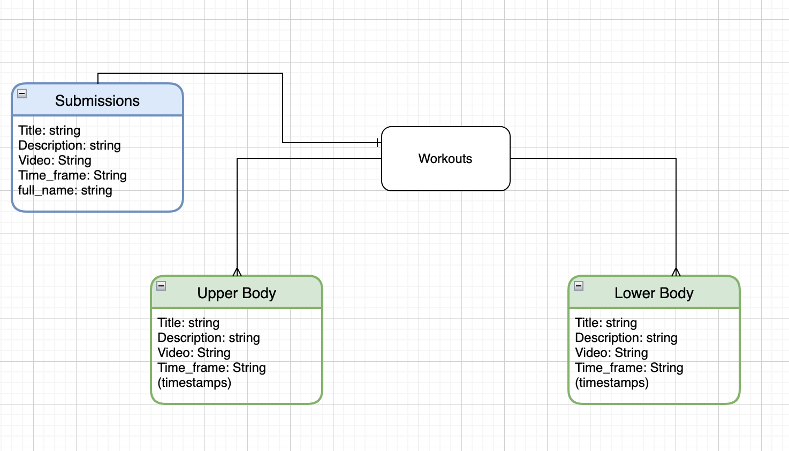
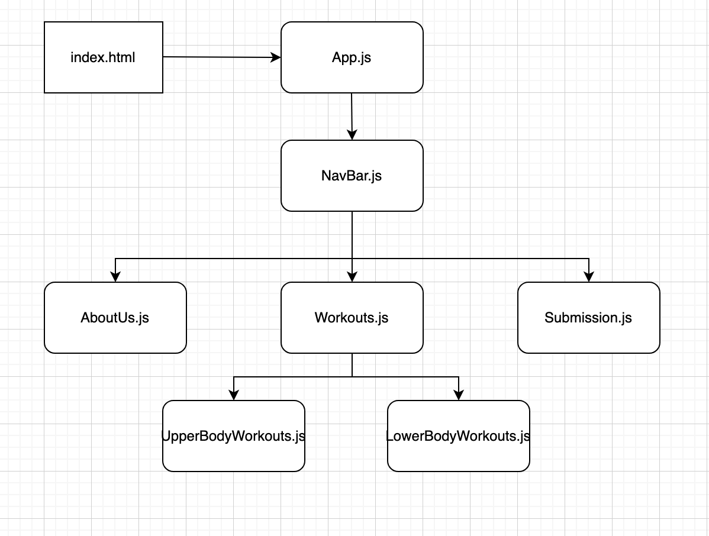

# Sweat-zone

## Description
For people that are starting their fitness goals or are pros at training, this site provides a guide for all the best workouts. It will include upper and lower body strength training guides that will include a description of the workout, time frame, and youtube link. Users will also be able to submit their own workouts to be featured on the page. 

The following technologies will be used: Mongoose, express, node, react, and CSS. 

## Backend 
The database will contain a title, brief description, estimated time frame, and a youtube link. 

Set Up: 
[]npm init -y
[]npm install mongoose
[]mkdir db models seed
[]touch db/index.js models/upperworkout.js lowerworkout.js seed/upperworkouts.js lowerworkout.js

## Frontend 

Set Up:
[] npx create-react-app client 
[] npm install react-router-dom 
[] npm install 
[] npm install axios 

## Links
Trello: https://trello.com/b/9Zh3zRFw/swear-zone

Layout: https://miro.com/app/board/uXjVOBsR_80=/

ERD:

Component hierarchy:

