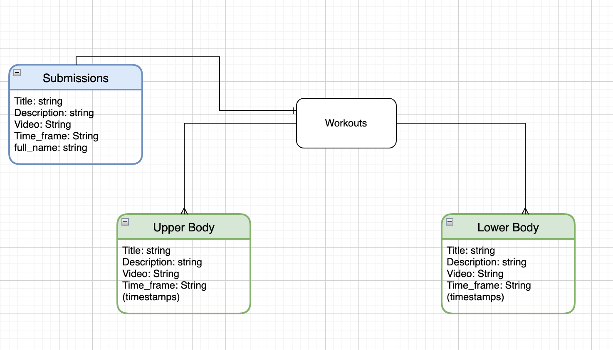
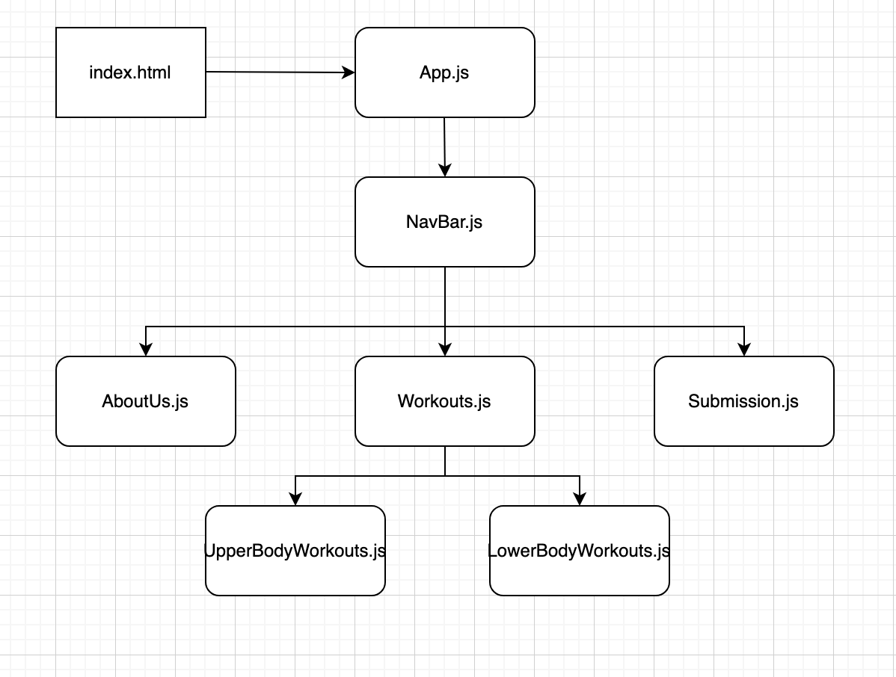

# Sweat-zone
In this project we were instructed to create a full stack website with CRUD functionality.

## Description
For people that are starting their fitness goals or are pros at training, this site provides a guide for all the best workouts. It will include upper and lower body strength training guides that will include a description of the workout, time frame, and youtube link. Users will also be able to submit their own workouts to be featured on the page. 

The following technologies will be used: Mongoose, express, node, react, and CSS. 

## Backend 
The database contains a title, brief description, estimated time frame, and youtube link for both lower and upper body workouts. 

## Frontend 
The front end has 4 different pages: home, upper body workouts, upper body workouts, and MySchedule. Both the upper body and lower body workout pages are connected to the backend and pull the information displayed on screen. The MySchedule page allows users to keep track of their workouts for the week to hold themselves accountable. Users can add a workout, mark it as a complete or delete it whenever they wish. 

## Future Goals 
1. Embeding the youtube videos so that users can view the workouts directly on the website instead of having to copy and paste the url.
2. Changing the MySchedule page to an account page were users can still track and plan their weekly workouts but also input meals with their macros. This would help users track their full workout journey.
3. Improve styling to make the website easier to use and beautiful! 

### Links
Trello: https://trello.com/b/9Zh3zRFw/swear-zone

Layout: https://miro.com/app/board/uXjVOBsR_80=/

ERD:

Component hierarchy:

### Resources Used:
GA lessons, labs and homework assignments from unit 2 
https://www.freecodecamp.org/news/how-to-perform-crud-operations-using-react/
https://www.youtube.com/watch?v=K5O6ZJ7WoZg
https://www.iamtimsmith.com/blog/this-state-how-to-use-state-in-react
https://reactjs.org/docs/hooks-effect.html
